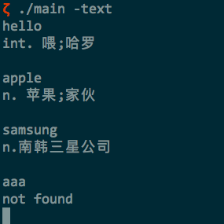
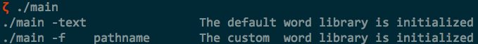

# dict
# 一、单词查询
给定文本文件“dict.txt”,该文件用于存储词库。词库为“英-汉”,“汉-英”双语词典,每个单词和其 解释的格式固定,如下所示:

- #单词
- Trans:解释1@解释2@解释n

每个新单词由“#”开头,解释之间使用“@”隔开。一个词可能有多个解释,解释均存储在一行里, 行首固定以“Trans:”开头。下面是一个典型的例子:

- #abyssinian
- Trans:a.阿比西尼亚的@n.阿比西尼亚人;衣索比亚人

该词有两个解释,一个是“a. 阿比西尼亚的”;另一个是“n. 阿比西尼亚人;依索比亚人”。
要求编写程序将词库文件读取到内存中,接受用户输入的单词,在字典中查找单词,并且将解释输 出到屏幕上。用户可以反复输入,直到用户输入“exit001”字典程序退出。
程序的执行格式如下

`./main -text

输入要查的单词即可`

# 二、支持用户自添加新词
用户添加的新词存放在指定文件中。如果待查单词在词库中找不到,则使用用户提供的词库。用户 的词库使用文本形式保存,便于用户修改。程序执行格式如下

`./main -f 用户词库文件名`
`-f 为固定参数,用来指定用户词库文件名`

使用时如果不指定-text 或 -f 会提示

`./main -text                The default word library is initialized`
`./main -f    pathname       The custom  word library is initialized`

